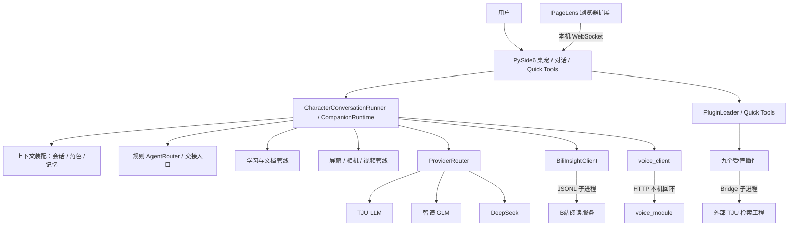

# Firefly AI Pet 技术设计文档

## 1. 目标、范围与需求

Firefly AI Pet 的目标是让个人 AI 助手以桌面宠物形式常驻，统一承载聊天、任务分流、学习、文档、视觉和媒体处理，同时保留对模型密钥、长期记忆和可选能力的用户控制。

### 功能需求

1. 用户可从桌宠、托盘、对话窗和 Quick Tools 发起请求，并看到运行状态。
2. 普通聊天可使用多家 OpenAI 兼容 Provider，失败时按确定顺序回退。
3. 会话上下文可读取本地记录；长期记忆只经授权写入路径持久化。
4. 学习、文档/PDF、屏幕/相机、视频、语音和外部 Agent 根据触发条件使用各自管线。
5. 能力插件可发现、启停、报告状态，缺失或出错时不使桌面主进程整体失效。

### 非功能需求

本地数据按用户目录隔离；敏感信息写入受规则阻断；摄像头和语音服务遵循显式触发；外部进程调用有协议与超时；界面保持可用并给出可诊断的失败状态。项目以 Windows 10/11 x64 为主要目标，源码说明支持 Python 3.10–3.13。跨平台能力尚不作为当前交付承诺。

## 2. 仓库边界与版本关系

本仓库保留原 GitLab `firefly-main` 分支的宿主和已集成插件历史。`app.py`、`core/`、`ui/`、`providers/` 是宿主；`plugins/` 包含当前纳管的 Quick Tools 插件源码；`extensions/pagelens_bridge/` 是浏览器桥接扩展。`optional_services/` 补充原独立插件工程中的 B站 JSONL 服务与语音 HTTP 服务源码。它们是**可选的独立服务**，不会因宿主启动而自动具备上游平台访问、模型权重或运行凭据。

`core/plugin_loader.py` 当前的 `MANAGED_PLUGIN_IDS` 列出九个受管 id。插件装载仍取决于用户插件根或 `FIREFLY_PLUGIN_PATH`，仓库中出现源码不表示插件已经在评委电脑上启用。B站服务还需上游 BiliInsight，语音服务的 RVC 权重和部分第三方运行依赖不在本仓库。历史文档若与当前入口代码冲突，以本分支的代码和本说明为准。

## 3. 系统架构

`app.py` 是组合根，创建窗口、角色运行时、PluginLoader、事件总线和能力门控。`ui/character_conversation_runner.py` 将聊天消息分流到视频、TJU、屏幕/摄像头、文档或普通对话路径。`core/companion_runtime.py` 负责一轮对话的上下文构造、显式记忆尝试、Provider 调用、会话保存和候选记忆抽取。`core/conversation_runtime.py` 保留兼容外观。

## 4. 模型与 Agent 调用链

### 4.1 普通对话

`输入 → CharacterConversationRunner → CompanionRuntime → 角色/历史/记忆上下文 → ProviderRouter → TJU → 智谱 → DeepSeek → 回答 → 会话记录`。路由器每次都从固定优先级首项开始，当前成功 Provider 只用于诊断状态；每个失败适配器被隔离，整次请求有 60 秒总预算。默认适配器从环境变量、本机凭据文件或 `.env` 解析配置，用户修改密钥后可热重建默认路由器。所有 Provider 均不可用时抛 `AllProvidersFailedError`，由上层提供失败反馈。

### 4.2 Agent 任务推荐

`TaskRequest → AgentRouter.recommend() → AgentRecommendation → Short Talk / 原生入口 / 不可用提示`。`AgentRouter` 为纯规则函数，不直接调用 LLM、不启动进程；`AutoRouter` 可生成交接包，`WorkspaceLock` 提供单工作区写入锁接口。原生 Agent 启动与生命周期观察属于宿主 UI/适配器层。由此可称项目有**任务分流与交接机制**，但不能把规则推荐等同于已验证的无人值守多 Agent 协同执行。

### 4.3 视觉模型

屏幕或摄像头显式请求在 `CharacterConversationRunner` 中分流到 `ScreenVisionService`；相机抓帧由宿主 `CameraCapture` 实现，插件 `firefly_camera_vision` 只报告设备状态和启用门控。视觉 Provider 的选择、失败回退和具体图像请求由宿主视觉模块负责；需要配置有效 Provider 凭据。插件本身不持有画面、不运行模型。

### 4.4 视频与语音模型

本地视频插件调用宿主 `VideoProcessor.process(video_path, vision_on_frames=False)`，使用 FFmpeg、ASR、场景检测、关键帧和 OCR；不将关键帧交给视觉大模型做语义描述。B站链的 `transcribe` 是下载音频后用本地 faster-whisper 推理，后续摘要走宿主 `core.ai_router`；指定时间点画面分析另经宿主 `video_frame_vision`。语音链为回复/点击播放 → `voice_client` → 可选本机 `voice_module` → 在线 edge-tts → 本机 RVC → 本机播放；不能宣称语音完全离线。

## 5. 核心模块设计

| 模块 | 主要职责 | 持久化或外部依赖 |
| --- | --- | --- |
| `app.py` + `ui/` | 桌宠、托盘、对话界面、Agent 面板、运行状态展示 | PySide6；可选外部 Agent CLI |
| `character/` | 角色身份、个性、对话与关系配置 | YAML 角色卡 |
| `core/companion_runtime.py` | 一轮对话的上下文与调用顺序 | 会话、记忆、Provider |
| `core/ai_router.py` + `providers/` | 三家模型适配与顺序回退 | API 密钥、网络 |
| `memory/` | 显式写入、候选建议、安全守卫、语义检索与一致性 | 本地记录、mem0/fastembed/Qdrant 本地模式 |
| `core/learning/` | 学习模式控制、课程/概念/测评/复习和规则决策 | 本地 SQLite |
| `core/document_*` + PDF/OCR | 多格式附件解析、检索、摘要、页面定位和 OCR | PyMuPDF、rapidocr 等 |
| `core/screen_vision/` | 屏幕/相机采集与视觉回答 | 设备、Vision Provider |
| `core/plugin_loader.py` | 插件发现、白名单、构造、启停、服务注入 | 用户插件根与启用设置 |
| `core/bili_insight_client.py` | 服务定位、JSONL 请求与错误归一化 | `optional_services/firefly_bili_insight_service/` |
| `voice_client/` | 聊天语音请求与服务降级 | `optional_services/voice_module/` HTTP 服务 |
| `extensions/pagelens_bridge/` | 浏览器选区/PDF 事件采集 | 本机 WebSocket 桥 |

宿主学习模式与 `learning_focus` 插件各有实现。前者有 SQLite 课程流程与编排器；后者是知识图谱规划、JSON 画像和规则评估的附加插件，历史插件材料标记为 WIP。文档和演示应分别展示，避免将两套数据存储混同。

## 6. 插件机制与工具调用

宿主 `PluginLoader` 从配置的用户插件根及 `FIREFLY_PLUGIN_PATH` 附加路径扫描 Python 包；先用 AST 读取 manifest id，仅 `MANAGED_PLUGIN_IDS` 中的九个 id 会被导入。`plugin.py::create_plugin(parent=None)` 必须返回 `QuickToolPlugin`，随后 `initialize(context)`、注册 Quick Tools、服务注入、`start/open/stop/shutdown`。启用状态可持久化并热切换。导入、构造、注册和生命周期异常按插件边界捕获。

这是一种**受管插件加载策略，不是强隔离沙箱**：白名单和禁止导入顶层 `app` 能减少误用，但获准插件仍在宿主 Python 进程中执行。需要更强隔离的 B站阅读和校园检索采用子进程；语音合成采用本机 HTTP 服务。

受管插件及实际职责：

| Manifest id | `plugins/` 目录 | 真实职责 |
| --- | --- | --- |
| `firefly-video` | `firefly_video_extension/` | 本地文件选择与宿主 VideoProcessor 调用 |
| `firefly-camera-vision` | `firefly_camera_vision/` | 设备可用性与相机能力门控 |
| `learning-focus` | `learning_focus/` | 学习增强规划/画像/规则评估，WIP |
| `tju-info-retrieval` | `tju_info_retrieval/` | 外部检索工程的搜索、登录与 GUI 桥接 |
| `firefly-voice` | `firefly_voice/` | 语音配置、状态、显式服务启停和试听 |
| `firefly-vision` | `firefly_vision/` | 宿主视觉能力的插件入口 |
| `firefly-learning` | `firefly_learning/` | 宿主学习能力的插件入口 |
| `firefly-voice-chat` | `firefly_voice_chat/` | 宿主语音聊天能力的插件入口 |
| `firefly-bili-video` | `firefly_bili_video/` | 宿主 B站视频能力的插件入口 |

## 7. 关键数据流与协议

### 7.1 会话与记忆

用户输入在对话前与角色、历史、检索到的记忆组合。普通聊天不会直接写入长期记忆；显式“记住”由 `MemoryService` 的写入策略与必经的敏感信息红线规则判定，还可接入额外安全守卫（默认是透传实现）。对话后的候选记忆可进入待确认队列，只有用户确认后才能走权威写入路径。权威记录和语义索引分开，索引同步失败有脏标记与核对机制。对话历史另由 ConversationStore 保存，不能把会话缓存等同于长期记忆。

### 7.2 学习

宿主 `LearningModeController` 与 `LearningLoopOrchestrator` 按检测、上下文、教学上下文、规则决策、动作接口组合一轮学习过程。课程和进度使用 SQLite；规则内核控制掌握度与复习状态。教学文本可由模型生成，但掌握度规则不能被随意描述为“LLM 自主评分”。附加 `learning_focus` 插件的 `profile.json`/`events.jsonl` 是另一套本地状态，当前仍 WIP。

### 7.3 文档与 PageLens

附件经文档解析器按格式提取文本；PDF 优先文本层，低覆盖时可调用本地 OCR；路由器根据问题选择文本检索、页码定位、摘要或视觉路径。PageLens 浏览器扩展通过 `ws://127.0.0.1:17321` 将选区、PDF 打开与页面上下文消息交给桌面桥；Chrome/Edge 内置 PDF Viewer 的 DOM 选区与页码不保证可取得。

### 7.4 B站 JSONL

宿主 `BiliInsightClient` 为 `health`、`metadata`、`transcribe`、`frame` 每次启动一个子进程，以一行 UTF-8 JSON 请求和响应通信。服务响应包含 `action/ok/data/error/latency_ms/service/version`。服务需另行克隆上游 BiliInsight，`transcribe` 需 faster-whisper 模型；`frame` 会在服务 `data/frames_out/` 落盘 JPEG，按需可返回 base64。宿主聊天路由已经调用 `core/video_reader.py`，因此 B站 URL 阅读并非仅孤立 CLI，但真实使用仍受服务安装与平台权限约束。

### 7.5 TJU Bridge 与语音 HTTP

TJU 适配器用 `shell=False` 独立子进程调用外部 Bridge CLI，规定 stdout 为单 JSON 对象；状态分 `READY/AUTH_REQUIRED/OFFLINE/ERROR`。READY 依据本地登录快照，检索时仍可能发现会话失效。语音服务默认监听 `127.0.0.1:8300`，提供 `/health`、`/voice/speak`、播放队列等接口；控制插件探测状态并按用户操作启停，不参与聊天模型决策。

## 8. 错误处理与降级策略

| 故障 | 设计行为 | 可信边界 |
| --- | --- | --- |
| 无模型密钥、某 Provider 失败或超时 | 界面可启动；路由器尝试下一个 Provider；全部失败才向上报告 | 60 秒总预算来自路由代码，真实网络表现未复测 |
| 记忆读取/保存或候选提取失败 | 对话运行时记录阶段错误并继续主回复路径 | 记忆完整性需后续核对索引 |
| 插件结构错误、未入白名单或启动异常 | 忽略或隔离该插件，继续装载其余项 | 获准插件在进程内，不构成权限沙箱 |
| 本地视频依赖缺失或处理错误 | 阶段降级或插件发布 ERROR，弹窗显示失败 | 完整六要素需真实视频和各引擎 |
| 摄像头不存在/视觉模型不可用 | 状态 UNAVAILABLE 或视觉失败回复 | 真实抓拍和释放需硬件环境验收 |
| 语音服务离线/模型缺失 | 插件显示 OFFLINE，语音失败不阻断聊天 | 服务源码已附，模型权重和外部依赖未随仓库完整部署 |
| B站网络、下载、模型或参数错误 | JSONL `error.type` 归类；客户端归一化超时、崩溃和协议错误 | 平台权限与上游版本会影响结果 |
| TJU 登录过期/工程缺失 | `AUTH_REQUIRED` 或 `ERROR`，提供手动登录/配置路径 | 当前提交版本未取得有效校园会话 |

## 9. 安全与隐私设计

- **数据位置**：宿主主要用户数据默认在 `%LOCALAPPDATA%\FireflyAI\` 下分离会话、记忆、学习、插件、日志与凭据目录；可用 `FIREFLY_USER_DATA_DIR` 改写。例外包括 `core/ai_router.py` 默认把 Provider 健康状态写到宿主 `core/provider_state.json`，学习增强插件默认写 `~/.firefly/learning_focus`（可单独覆盖）。
- **记忆边界**：普通聊天不直接写长期记忆；自动来源只能进入待确认建议；显式写入仍受敏感信息规则检查。
- **凭据边界**：密钥在用户目录的 JSON 凭据文件中，以原子替换保存并尽量收紧权限；**当前未见 DPAPI/系统级加密实现**，不能宣传为加密保险库。真实 `.env`、B站 Cookie 和校园登录态不得提交。
- **设备与本机服务**：相机插件不主动打开摄像头；语音服务显式启动。语音和 PageLens 默认监听回环地址；如改为公网/局域网监听，现有本机信任假设即不再成立，需要新增认证和访问控制。
- **跨进程输入**：B站 JSONL 与 TJU Bridge 有有限 action/命令、参数解析、超时和结构化错误。二者仍依赖外部网络或受控浏览器。
- **许可边界**：宿主及多数插件按 MIT；`optional_services/firefly_bili_insight_service/` 为 GPL-3.0-or-later；RVC vendor 和外置模型需分别核对许可证。子进程边界是工程隔离方式，不替代法律审查。

## 10. 部署、扩展性与兼容性

源码启动顺序为：准备 Windows/Python 环境 → 安装宿主 `requirements.txt` → 启动 `app.py` → 配置至少一个模型密钥 → 按需将仓库 `plugins/` 中的受管插件装入用户插件根 → 分别部署 B站、语音、TJU 等可选外部依赖。`FIREFLY_PLUGIN_ROOT`、`FIREFLY_BILI_INSIGHT_ROOT`、`TJU_INFO_RETRIEVAL_ROOT` 用于定位组件，不能互换。

新增 Quick Tools 能力需要符合 manifest/factory 契约并被宿主受管白名单接受；新服务可参考 JSONL 或本机 HTTP，但应给出协议版本、超时、错误分类和凭据处理。历史 `extensions/` 镜像与当前 `plugins/` 有版本差异，建议发布流程增加同名文件版本比对和新用户安装验证。

## 11. 测试与证据分级

| 证据等级 | 本次结论 |
| --- | --- |
| 当前 GitLab 分支静态核对 | 保留远端现有源码历史；核对了 `core/plugin_loader.py` 的九项白名单、根目录设计文档及演示文件路径 |
| 此前预备包验收 | Windows release ZIP 完整性通过并在新目录解压；启动后的单实例互斥使新目录 GUI/聊天不能记为通过 |
| 本轮尚未实测 | 未复跑远端当前分支全量测试、独立新目录 GUI、真实摄像头、模型 API、B站、语音模型和校园检索端到端 |
| 随仓历史记录 | README 与 `docs/` 记录开发者测试；可作为背景材料，不能代替本轮现场复测 |

实际演示仍需在具有相应模型密钥、校园授权与可选依赖的电脑上完成。TJU 真实检索在此前插件包历史记录中曾返回 `AUTH_REQUIRED`；这不是当前 GitLab 分支的端到端通过证据。
