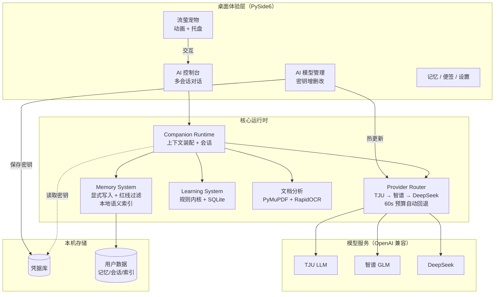

# Firefly AI Pet

**一只住在桌面上的萤火虫 AI 伙伴 —— 让 AI 的工作看得见，让密钥与记忆留在你自己的电脑里。**


[](../../releases)


> 天津大学 AI Agent 创新赛参赛项目 · agent2026-firefly-agent

---

## 项目简介

Firefly AI Pet 是一个运行在 Windows 桌面上的**个人 AI 伙伴**：一只常驻右下角的流萤宠物，承载对话、学习、文档分析与 Agent 协作能力。

它解决的问题是——**把散落在网页、文档、终端里的 AI 能力，收敛成一个看得见、管得住、记得住的桌面入口**：

- **看得见**：Agent 的思考/执行/等待状态，实时映射为流萤的动画与托盘状态；
- **管得住**：模型密钥由用户在本机图形界面中添加、替换、删除，保存即热更新，无需重启；
- **记得住**：长期记忆只接受用户显式指令写入，敏感信息红线过滤，全部数据保存在本机。

项目采用 Python + PySide6 构建，提供免安装便携包，解压即用。

## 核心能力

### 🐞 AI 智能伙伴

- 桌面常驻宠物 + 系统托盘 + AI 控制台三合一交互
- 七态动画（idle/thinking/working/waiting/success/error/sleeping）映射真实 Agent 生命周期
- 快捷提问气泡、对话历史多会话管理、记忆/文档上下文自动装配

### ⚙️ 多模型 Provider 管理

- **AI 模型管理窗口**：卡片式添加 / 替换 / 删除 API Key，保存即热更新（无需重启）
- 内置 TJU LLM、智谱 GLM、DeepSeek 三家 OpenAI 兼容 Provider，按 `TJU → 智谱 → DeepSeek` 自动回退，60 秒总预算
- 凭据保存在本机凭据库（用户数据目录，仓库之外），支持来源标识：`environment` > `credential_store` > `dotenv` > `missing`
- 未配置任何密钥时优雅降级：界面与全部本地功能照常可用

### 🔒 Memory Boundary（记忆边界）

- 长期记忆**只接受显式指令**（"记住…"句式）写入；普通聊天零写入
- 机器来源（自动抽取）只能进入"待确认"建议队列，由用户决定是否采纳
- 敏感信息红线过滤器常开：私钥 / JWT / 云密钥 / 身份证 / 银行卡等模式硬阻断入库
- 语义索引完全本地化（Qdrant 本地模式 + fastembed 本地嵌入），记忆内容不出本机

### 📚 学习模式

- 确定性规则内核裁定掌握度（LLM 只负责"讲课"，不做裁判）
- 课程 / 概念 / 复习计划 / 学习会话全流程追踪（SQLite 本地存储）
- 与 PageLens 文档阅读联动：从教材到出题到复习闭环

### 📄 文档分析

- 支持 PDF / DOCX / PPTX / TXT / MD / XLSX / CSV 附件问答
- PDF 原生文本层优先，扫描件自动回退 RapidOCR 离线识别
- PaperLens 阅读模式：页面渲染 + 概念卡 + 选中即解释
- 文档路由器自动分发：文本问答 / 页面定位 / OCR / 摘要 / 视觉理解

### 🧩 Agent 扩展

- Quick Tools 插件体系：摄像头视觉、视频分析、TJU 信息检索、学习增强（插件体独立分发）
- Claude Code / Codex CLI 生命周期监控与工作台集成
- 白名单加载 + AST 只读探测，插件故障相互隔离

## 系统架构



## 技术特点

- **本地优先**：记忆、会话、便签、语义索引全部落在本机用户目录；凭据库在仓库之外，永不进入版本控制
- **优雅降级**：无密钥、缺插件、离线、缺可选组件——每一条依赖缺失路径都有明确的降级行为，绝不崩溃
- **零 SDK 依赖的 Provider 直连**：stdlib `urllib` 直连 OpenAI 兼容接口，固定 60 秒预算、逐跳回退、健康状态持久化
- **确定性记忆边界**：规则引擎（而非 LLM）决定"什么能被记住"，红线过滤器不可关闭
- **原子写与故障隔离**：配置、记忆、会话全部原子替换写入；插件/桥/文档解析器故障相互隔离
- **工程化交付**：PyInstaller onedir 便携打包、GitHub Actions 三版本矩阵 CI（稳定核心测试集）、SHA256 校验发布
- **测试规模**：项目包含约 2600 项本地自动化测试；针对硬件、视觉等环境依赖模块，CI 采用稳定核心测试集持续验证；rc2 发布前完成 166 项关键回归验证

## Demo 展示

> 以下截图位（对应 `docs/screenshots/`，随版本提交更新）

| 场景 | 截图位 |
|---|---|
| 桌面宠物 + 控制台 | `docs/screenshots/desktop-companion.png` |
| AI 模型管理窗口（密钥增删改） | `docs/screenshots/provider_manager_window_rc2.png` |
| 设置入口（AI STATUS 状态总览） | `docs/screenshots/provider_settings_entry_rc2.png` |
| Memory 边界（显式记忆 vs 普通聊天） | *待补充* |
| 文档阅读 + OCR | *待补充* |

<!-- 截图文件随版本提交后自动显示；未提交前此处为占位说明 -->

## 快速开始

### 方式一：便携包（推荐普通用户）

1. 从 Release 页下载 `Firefly_AI_Pet_v1.0-rc2_win64.zip`，解压到**用户可写目录**
2. 双击 `Firefly_AI_Pet.exe`（首次启动如遇 SmartScreen 提示，选择"仍要运行"）
3. 托盘图标出现即启动成功；配置密钥见下方"模型密钥配置"

### 方式二：源码运行（开发者）

```powershell
git clone https://github.com/Liuyingandying/Firefly-AI-Pet.git
cd Firefly-AI-Pet
python -m venv .venv
.\.venv\Scripts\python.exe -m pip install -r requirements.txt
.\.venv\Scripts\python.exe app.py
```

要求：Windows 10/11 x64，Python 3.10 – 3.13。

### 模型密钥配置（三选一）

| 方式 | 说明 |
|---|---|
| **AI 模型管理窗口**（推荐） | 设置 → AI 模型管理 → 添加密钥，保存即热更新 |
| 系统环境变量 | `TJULLM_API_KEY` / `ZHIPU_API_KEY` / `DEEPSEEK_API_KEY` |
| `.env` 文件 | 放置于 `_internal\.env`（参考包根 `.env.example`） |

### 首次使用提示

- 首次记忆写入需联网下载本地嵌入模型（约 30MB）；受限网络可设置 `HF_ENDPOINT=https://hf-mirror.com` 后重启
- 退出请使用托盘图标右键 → 退出

## 项目结构

```text
Firefly_AI_Pet/
├── app.py                 # 应用入口与组合根
├── core/                  # 运行时核心（会话/路由/凭据/学习/文档/视觉）
│   ├── ai_router.py       #   Provider 回退路由
│   ├── credential_store.py#   本机凭据库
│   ├── provider_manager.py#   模型状态查询层
│   ├── learning/          #   学习模式子系统
│   └── screen_vision/     #   屏幕/摄像头视觉
├── ui/                    # PySide6 界面（控制台/托盘/弹窗/管理窗口）
├── memory/                # 记忆系统（服务/存储/建议/边界守卫）
├── providers/             # 模型适配器（TJU/智谱/DeepSeek）
├── character/             # 流萤角色设定
├── voice_client/          # 语音播报客户端（可选）
├── packaging/             # 打包定义与发布验证脚本
├── extensions/            # 浏览器扩展（PageLens）
├── config/                # 默认配置模板
├── tests/                 # 测试套件
└── docs/                  # 设计与发布文档
```

## Roadmap

**已完成（v1.0-rc2）**

- ✅ AI 模型管理窗口与凭据库（添加/替换/删除，保存即热更新）
- ✅ 无密钥优雅降级与三模型自动回退
- ✅ Memory 边界与显式写入守护（冻结冒烟验证）
- ✅ Windows 便携包与三版本矩阵 CI
- ✅ PDF 离线 OCR 与文档附件分析

**计划中（v1.0-rc3+）**

- 🔜 预置本地嵌入模型缓存，实现完全离线首启
- 🔜 自定义 OpenAI 兼容 Provider（用户可添加任意端点）
- 🔥 发布包代码签名
- 🔥 记忆检索下载超时与后台降级
- ⏳ 跨平台（Linux/macOS）评估
- ⏳ 学习模式课程库扩充

## Plugin Ecosystem

Firefly AI Pet supports modular capability extensions.

Plugin repository:

https://github.com/Liuyingandying/Firefly-AI-Pet-Plugins


Included:

- Video Extension
- Vision Extension
- Learning Assistant
- Campus Information Bridge

## License

本项目基于 [MIT License](LICENSE) 开源。

Copyright © 2026 Fuyong
