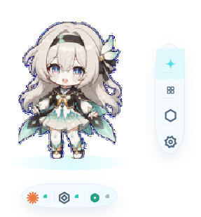
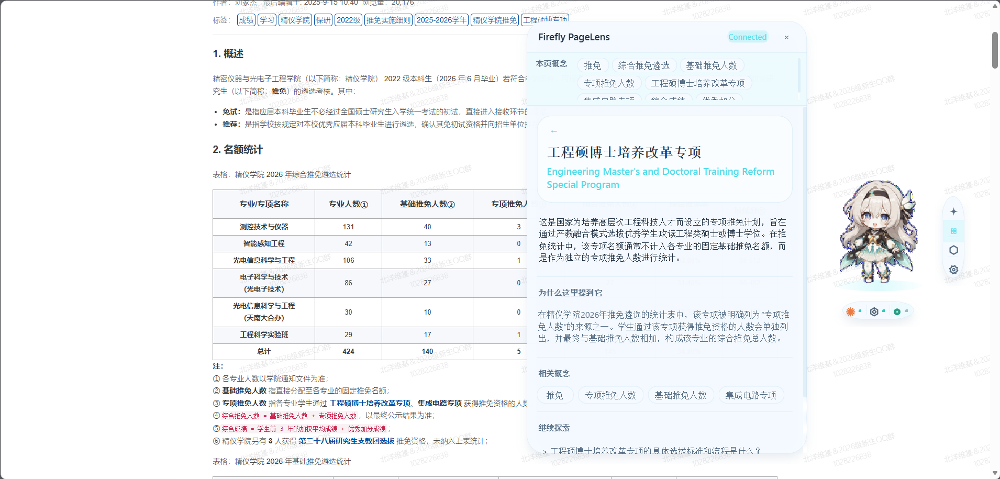
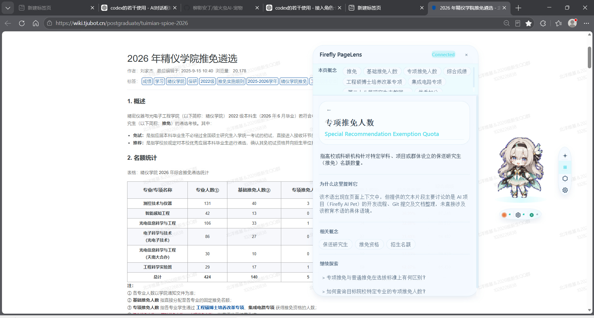
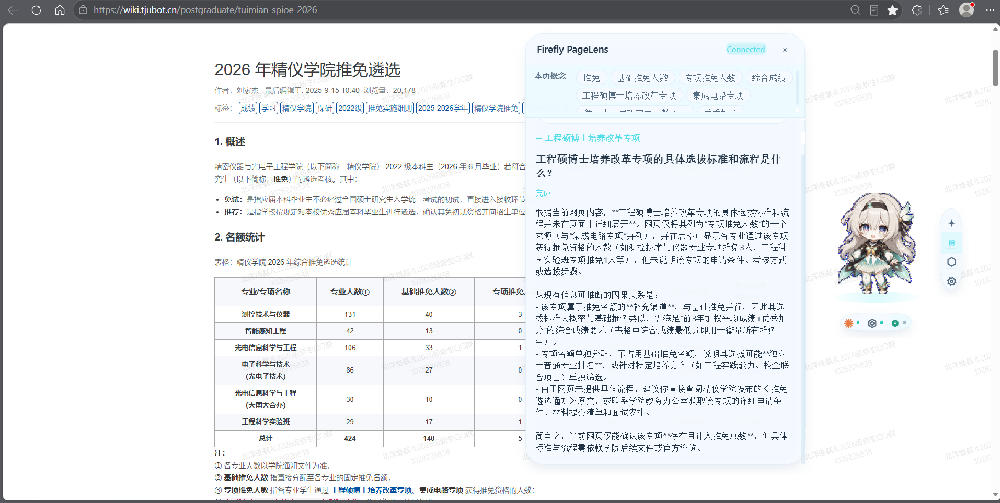

# Firefly AI Pet

> A desktop AI companion powered by multi-agent orchestration.

Firefly AI Pet is a **desktop AI companion framework** that brings agent workflows, browser context, and LLM provider routing into one interactive desktop experience. It began as the Codex Firefly Desktop Pet prototype and has evolved into an AI Companion Platform for coordinating agents, understanding web content, and supporting automated workflows.

Firefly AI Pet explores how AI agents can evolve from task-oriented tools into persistent digital companions.

Firefly remains the project's visual identity and personality: a friendly presence on the desktop that makes AI activity visible and approachable, while the framework beneath it handles substantially more than a traditional desktop pet.

## Project Evolution

```text
Codex Firefly Pet (Prototype)
              ↓
       Firefly AI Pet
              ↓
Multi-Agent Desktop Companion
```

The project started as a desktop companion that visualized Codex status. It has since grown into a platform integrating AI agents, browser understanding, provider-independent model access, and automated workflows.

## Features

### AI Agent Integration

- Codex agent integration
- Claude Code status integration
- Multi-provider LLM routing
- DeepSeek API provider
- TJU Qwen API provider
- Extensible provider architecture

### Browser Intelligence

PageLens is the browser context-awareness module. It provides:

- Webpage context extraction
- Concept discovery
- AI-assisted explanation
- Follow-up question exploration

PageLens collects and structures browser context, then sends it through the AI routing layer. It is not an AI model itself.

### Desktop Companion

- Firefly-themed UI and project personality
- Frameless, always-on-top desktop overlay
- Agent status visualization
- Interactive AI companion panel

### Workflow System

- Task orchestration
- Session management
- Workspace management

## Architecture Overview

```text
Firefly Desktop Companion
          |
      Agent Router
          |
          +-- Agent Integration
          |   +-- Codex
          |   `-- Claude Code status
          |
          +-- LLM Providers
          |   +-- DeepSeek API
          |   +-- TJU Qwen API
          |   `-- Extensible providers
          |
          `-- PageLens Context Layer
              `-- Webpage context -> concepts -> questions
```

At runtime, Firefly connects the desktop interface to three distinct layers: agent integrations, configured LLM providers, and PageLens browser context. Claude Code currently contributes lifecycle and status information; this does not imply that the Claude API is configured as an LLM provider.

## Supported Providers

| Integration | Purpose |
|---|---|
| Codex | Coding agent integration |
| Claude Code | Agent status integration |
| DeepSeek API | LLM provider |
| TJU Qwen API | Knowledge/explanation provider |
| Others | Extensible provider architecture |

Provider availability depends on the local environment and configuration. Credentials and private runtime configuration are intentionally kept outside version control.

## Demo Screenshots

### 1. Desktop AI Companion

Firefly's desktop presence and the interactive AI Companion interface.



### 2. Browser Context Understanding

PageLens extracts and organizes webpage context for AI-assisted understanding.



### 3. Concept Exploration

Concept cards support focused discovery and deeper explanations of ideas found on a page.



### 4. Interactive Question Loop

Follow-up questions extend the current context into an interactive exploration flow.



## Getting Started

### Requirements

- Windows
- Python 3 (tested on Python 3.13.9)
- PySide6 and the dependencies in `requirements.txt`

### Setup

```powershell
cd E:\Firefly_AI_Pet
python -m venv .venv
.\.venv\Scripts\python.exe -m pip install -r requirements.txt
```

### Run

```powershell
.\start_pet.ps1
```

Firefly appears as a transparent, always-on-top companion near the bottom-right of the primary monitor. Drag it to reposition the overlay or click it to open the companion interface.

### Stop

```powershell
.\stop_pet.ps1
```

## Companion Interaction

| Interaction | Action |
|---|---|
| Short left-click | Show or hide the companion panel |
| Left-drag | Move Firefly without opening the panel |
| Workspace selection | Select and reopen recent workspaces |
| Agent launch | Open supported agent entry points in the selected workspace |
| Quick Ask | Ask a configured agent without leaving the desktop |
| Right-click menu | Pause, resume, reset position, or quit |

Quick Ask uses conservative agent modes for lightweight questions. Use the full agent workflow when a task needs to modify a project.

## Agent Status Visualization

Firefly resolves status updates from supported agents into one visible desktop state.

| State | Companion behavior |
|---|---|
| `idle` | Waiting for activity |
| `thinking` | Reviewing or reasoning |
| `working` | Executing an active task |
| `waiting` | Waiting for user input or permission |
| `success` | Task completed |
| `error` | Task failed |
| `sleeping` | Session inactive |

Each agent writes its own runtime source state. The state broker combines those sources by priority and timestamp, ignores incomplete state files safely, and expires transient states to keep the desktop indicator accurate.

## Evolution History

### v0.1 prototype

- Codex Firefly Pet
- Desktop visualization of Codex activity

### v0.1.0

- Firefly AI Pet demo
- Interactive desktop companion foundation

### v0.1.1

- PageLens question loop
- Browser-context exploration from the desktop companion

## Roadmap

- More agent integrations
- Better memory system
- Plugin ecosystem
- Improved companion interaction

## Project Status

Firefly AI Pet is under active development. Interfaces, provider support, and workflow behavior may continue to evolve as the companion framework matures.
