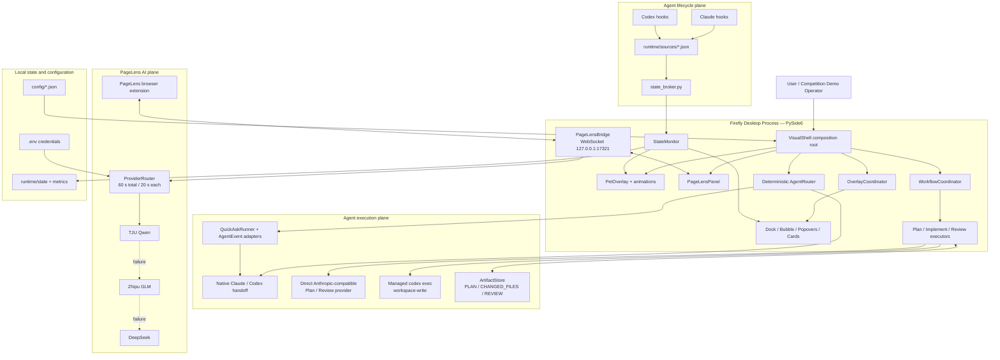

# Firefly AI Pet — Phase D Release Review

> Review date: 2026-08-20  
> Scope: current `E:\Firefly_AI_Pet` workspace  
> Review mode: source inspection, offline regression, and Phase D online acceptance evidence  
> Code changes during review: none

## 1. Executive summary

Firefly AI Pet has evolved from an animated desktop status companion into a
character-centered multi-agent desktop gateway. The current product combines:

- a PySide6 always-on-top desktop pet and lightweight overlay system;
- Claude/Codex lifecycle monitoring, Short Talk, native handoff, and a guarded
  Plan → Implement → Review workflow;
- a localhost PageLens Desktop Bridge;
- a new OpenAI-compatible Provider Router with fixed
  TJU → Zhipu → DeepSeek fallback and a 60-second global timeout budget.

**Release decision:**

- **Conditional GO for the Phase D PageLens AI Router demonstration.** TJU direct
  success and TJU/Zhipu failure → DeepSeek success were both verified online,
  including real Desktop Bridge responses.
- **NO-GO for claiming the complete Claude → Codex → Claude workflow as fully
  production-certified.** The last recorded controlled full-chain E2E run was
  NO-GO. Later H2/H4 hotfix suites pass offline, but the complete online chain has
  not yet been re-certified from Plan through Review.
- **NO-GO for creating a release tag from the current working tree.** Key Phase D
  files are still untracked or modified, and the repository-wide pytest entry
  point currently fails during collection.

## 2. Current system architecture

### Architectural boundary that must remain explicit

Firefly currently has two different routers:

1. `core.agent_router.AgentRouter` is a deterministic, offline recommendation
   engine. It chooses Claude, Codex, or an unavailable route based on task intent.
2. `core.ai_router.ProviderRouter` is an online model-provider fallback engine for
   PageLens chat. It chooses TJU, Zhipu, or DeepSeek based on availability.

They solve different problems and should not be merged into one state machine.

## 3. Completed modules

| Area | Completed capability | Main implementation |
|---|---|---|
| Desktop shell | Frameless, transparent, always-on-top animated pet; drag, scaling, overlay anchoring | `app.py`, `ui/pet_overlay.py`, `ui/overlay_coordinator.py`, `ui/theme.py` |
| Lifecycle state | Per-agent source files, priority/TTL resolution, 150 ms polling, atomic resolved state | `state_broker.py`, `core/state_monitor.py`, `core/models.py` |
| Workspace/session | Current and recent workspaces, native session metadata, session continuation | `core/workspace_manager.py`, `core/session_manager.py`, `ui/workspace_store.py` |
| Short Talk | Claude/Codex managed CLI requests, streaming/JSONL adapters, stop and retry UX | `ui/process_launcher.py`, `core/agent_adapters.py`, `core/agent_events.py` |
| Agent recommendation | Deterministic intent routing and user-confirmed native handoff | `core/agent_router.py`, `core/routing_models.py`, `core/handoff.py` |
| Workflow core | Confirmation-gated Plan → Implement → Review state machine | `core/workflow_coordinator.py`, `core/workflow_models.py` |
| Workflow artifacts | Safe atomic PLAN, CHANGED_FILES, IMPLEMENTATION_SUMMARY, REVIEW storage | `core/artifact_store.py`, `core/workspace_snapshot.py`, `core/review_context.py` |
| Workflow execution | Direct-provider Plan/Review and managed non-interactive Codex implement | `ui/workflow_executor.py`, `ui/workflow_implement_executor.py`, `ui/workflow_review_executor.py` |
| PageLens UI | Desktop PageLens panel, concept/question navigation, global hotkey | `ui/pagelens_panel.py`, `app.py` |
| Desktop Bridge | Loopback WebSocket bridge, strict message types, async AI calls off the UI loop | `core/pagelens_bridge.py` |
| Provider adapters | Shared OpenAI-compatible transport and normalized completion format | `providers/base.py`, `providers/tju_qwen.py`, `providers/zhipu_glm.py`, `providers/deepseek.py` |
| Provider Router | TJU → Zhipu → DeepSeek fallback, health state, 20 s attempts, 60 s total budget | `core/ai_router.py` |
| Windows operations | Detached launch, graceful control-socket shutdown, single instance, startup support | `start_pet.ps1`, `stop_pet.ps1`, `tools/stop_pet.py`, `core/windows_autostart.py` |

## 4. Verified functionality

### 4.1 Current offline regression run

Executed during this review:

| Suite | Result |
|---|---:|
| `pytest tests -q` | 13 passed |
| Phase 9D.6-H2 hotfix suite | 68 passed |
| Phase 9D.6-H4 direct-provider suite | 62 passed |
| Total targeted checks | **143 passed** |

The targeted suites cover Provider Router fallback/budget behavior, Desktop
Bridge AI requests, Plan validation, managed Codex execution contracts,
direct-provider Plan/Review behavior, cancellation, artifact safety, and key
regressions.

### 4.2 Phase D real online acceptance

#### TJU normal route

- Route: `ProviderRouter → TJU`
- Provider: `tju`
- Actual model: `qwen3.6-35b-a3b`
- Router latency: 6,285.80 ms
- Result marker: `FIREFLY_PHASE_D_TJU_OK`
- Desktop Bridge independently returned `provider=tju` in 417.65 ms.

#### DeepSeek fallback route

- Route: `TJU (simulated 401) → Zhipu (simulated 401) → DeepSeek`
- Provider: `deepseek`
- Actual model: `deepseek-v4-flash`
- Per-hop latency: TJU 172.20 ms; Zhipu 106.28 ms; DeepSeek 910.59 ms
- Router total latency: 1,204.25 ms
- Result marker: `FIREFLY_PHASE_D_DEEPSEEK_OK`
- Desktop Bridge independently returned `provider=deepseek` in 994.20 ms.

#### Zhipu observations

- Zhipu succeeded during an earlier online fallback acceptance and returned
  `glm-4.7-flash`.
- A later retry returned HTTP 429 twice because the model was overloaded.
- The fallback logic behaved correctly, but Zhipu should currently be presented
  as available but operationally unstable rather than guaranteed.

### 4.3 Security and isolation behavior verified by code/tests

- `.env` is ignored by Git and credentials are not written into router state.
- Provider credentials are resolved from the process environment first and the
  project `.env` second.
- PageLens Bridge binds only to `127.0.0.1`.
- Workflow artifacts validate identifiers and prevent path escape.
- Workflow Plan/Review credentials remain in memory and are excluded from config
  repr and artifacts.
- Workflow execution retains explicit user confirmation gates and does not treat
  process spawn or exit as task success.

## 5. Current known issues

### Release blockers

1. **Current Git working tree is not release-ready.** `.gitignore` and
   `core/pagelens_bridge.py` are modified, while `core/ai_router.py`, the
   `providers/` package, and `tests/` are untracked. A release commit/tag would
   omit critical Phase D functionality unless the tree is curated first.
2. **Repository-wide pytest collection fails.** A duplicate
   `test_phase7a_core.py` under `Firefly_AI_Pet_Phase7A_Upgrade/payload/tools/`
   conflicts with `tools/test_phase7a_core.py`. Targeted suites pass, but the
   standard one-command release gate is broken.
3. **The complete Plan → Implement → Review online chain is not currently
   certified.** The last controlled full E2E report was NO-GO. H2 replaced the
   detached TTY-dependent Codex path with managed `codex exec`, and H4 moved
   Plan/Review to a direct provider; their offline suites pass, but the complete
   online chain has not been rerun successfully after both changes.

### High-priority operational issues

4. **Zhipu availability is unstable.** Real calls produced HTTP 429 under load.
5. **Bridge origin authentication is weak.** The server is loopback-only but
   currently accepts all WebSocket origins. A local malicious page/process could
   attempt to connect; add an extension allowlist or a short-lived handshake
   token before wider distribution.
6. **Upstream HTTP error details need stronger redaction.** Provider response
   bodies are included in `ProviderHTTPError`; upstreams may include credential
   fingerprints or sensitive diagnostics. Sanitize before logging or exposing
   errors outside tests.
7. **Workflow state is in memory.** A Firefly restart can lose an active workflow
   and its executor baseline even though artifacts survive on disk.

### Release-quality and maintainability issues

8. **`.env.example` is currently absent.** `.gitignore` contains an exception for
   it, but the distributable template file is missing from the working tree.
9. **Mutable Provider Router state lives under `core/`.** Move
   `core/provider_state.json` to `runtime/` or `config/` so runtime writes are not
   mixed with source modules.
10. **README is stale.** Its title still describes “Core v1 + Phase 7A” and does
    not document the current Phase 8/9/D architecture or online Provider setup.
11. **Pytest cache is not writable in the current environment.** Tests pass, but
    pytest emits cache warnings. This is not a product failure, but it adds noise
    to release evidence.
12. **Router observability is minimal.** State records failure counts and the last
    successful provider, but not per-request latency, HTTP class, or a safe
    circuit-breaker/backoff state.

## 6. Recommended next phase

### P0 — Release engineering and reproducibility

1. Curate the working tree, add all intended Phase D files, restore
   `.env.example`, and create a signed/tagged release candidate.
2. Remove or exclude the duplicate upgrade payload from pytest discovery and add
   one canonical command that runs every supported suite.
3. Update README and add a clean-machine setup/acceptance checklist.

### P1 — Full workflow re-certification

1. Run a disposable online Plan → managed Codex Implement → user confirmation →
   direct Review scenario after the H2/H4 changes.
2. Require a valid PLAN artifact, a real workspace diff, a passing local test,
   and a REVIEW artifact before marking the release green.
3. Persist resumable workflow metadata and the implement baseline before adding
   new workflow types.

### P1 — Provider and Bridge hardening

1. Add safe structured telemetry for provider, model, latency, status class, and
   fallback reason without storing prompts or credentials.
2. Add bounded backoff/circuit breaking for repeated 429/5xx responses.
3. Add Bridge origin authentication and sanitize upstream error bodies.
4. Move router health state into `runtime/` and define retention/reset behavior.

### P2 — Competition presentation package

1. Prepare a three-minute deterministic demo script:
   desktop lifecycle animation → Agent recommendation → PageLens concept request →
   TJU response → forced DeepSeek fallback → guarded workflow card.
2. Record a backup video because live Provider availability can fluctuate.
3. Add one slide that distinguishes Agent Router, Workflow Coordinator, and
   Provider Router; this is the project’s clearest architectural differentiator.
4. Present measured figures rather than claims: 143 targeted checks passing,
   TJU online success, DeepSeek fallback in about 1.2 seconds, and a 60-second
   hard routing budget.

## 7. Development milestone summary for competition use

| Milestone | Delivered outcome | Demonstration value |
|---|---|---|
| Core / Phase 4 | Multi-agent lifecycle files drive seven pet animation states | Makes invisible agent activity visible on the desktop |
| Phase 7A–7B | Workspace launcher, Quick Ask, streaming events, resumable sessions | Turns the pet into a usable AI entry point |
| Phase 8 | Character-centered light-glass overlay shell and lifecycle services | Establishes a distinctive desktop product experience |
| Phase 8C | Provider-neutral AgentEvent adapters and isolated Short Talk | Separates UI from Claude/Codex stream formats |
| Phase 9A–9C | Deterministic Agent Router, recommendations, confirmed native handoff | Routes tasks safely without autonomous surprise execution |
| Phase 9D | Confirmation-gated Plan → Implement → Review with artifacts | Demonstrates auditable multi-agent coordination |
| Phase C–D | PageLens Desktop Bridge and TJU → Zhipu → DeepSeek Router | Adds resilient online knowledge assistance with measured fallback |

## 8. Competition narrative

Firefly is not positioned as another chat window. It is a desktop coordination
layer that makes AI work visible, routes each request to the right execution
surface, and preserves explicit human control at every action boundary.

The strongest competition story has three parts:

1. **Presence:** the animated character reflects real Claude/Codex lifecycle
   state rather than playing decorative loops.
2. **Coordination:** deterministic routing and confirmation-gated workflows keep
   analysis, implementation, review, and artifacts separated and auditable.
3. **Resilience:** PageLens can continue serving a request across TJU, Zhipu, and
   DeepSeek while staying inside a 60-second routing budget.

The release should avoid claiming full autonomous workflow reliability until the
post-H4 online chain is green. Presenting this boundary honestly strengthens the
engineering story: Firefly treats “process started,” “model replied,” and “task
actually succeeded” as different states.

## 9. Final acceptance matrix

| Release surface | Status | Evidence |
|---|---|---|
| Desktop pet and overlay shell | GO | Current composition root and mature Phase 7–9 regression suites |
| Lifecycle monitoring | GO | State broker/monitor architecture and regression coverage |
| Agent recommendation / handoff | GO with user confirmation | Deterministic router and handoff regression coverage |
| PageLens Desktop Bridge | Conditional GO | Local WebSocket online acceptance; origin hardening still recommended |
| TJU Provider route | GO | Real Router and Bridge success |
| Zhipu fallback | Conditional | Previously succeeded; later HTTP 429 instability |
| DeepSeek fallback | GO | Real Router and Bridge success after two forced failures |
| Provider timeout budget | GO | Offline budget tests; online requests stayed well below 60 s |
| Full Plan → Implement → Review online workflow | NO-GO pending retest | Last full E2E NO-GO; post-hotfix offline tests green |
| Release tag / distributable package | NO-GO pending cleanup | Dirty/untracked critical files and broken full pytest collection |
